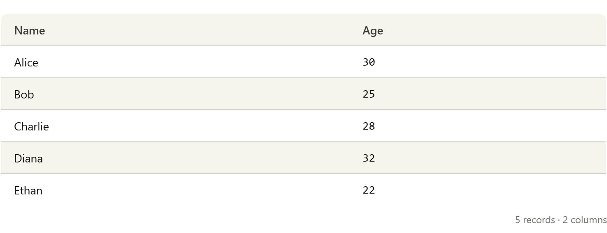
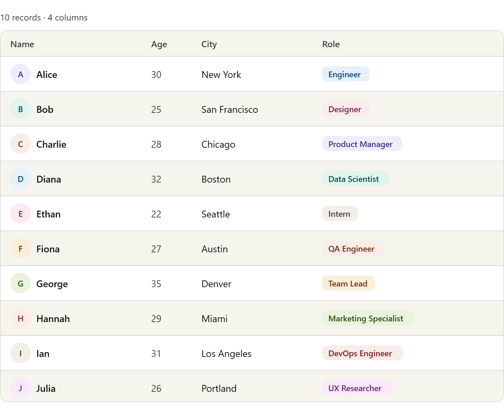

# **Create a skill in claude**
- In this note, I'll explain how we can create a skill in Claude.
- For this example, we will create a simple skill that teach claude when user gives a JSON data followed by word beautify, it'll just beautify it and show it in nice table.
- We'll also have a look at what happens under the hood when Claude uses it.

# **Show available skills**
- You can use the following prompt `what skills are available?` to know which skills are available in the environment.

# **Commands**
1. Make a pr-description folder inside ~/.claude/skills, creating parent directories if needed (-p):
```bash
mkdir -p /home/claude/json-beautify
```
2. Once the `json-beautify` directory is created, `cd json-beautify` to change to the directory.
3. If not exists, create a `SKILL.md` file.
4. Write the following content.
```markdown
---
name: json-beautify
description: Use this skill whenever the user provides JSON data and says "beautify", "prettify", "make this pretty", "show as table", or any similar phrase indicating they want their JSON displayed in a clean, readable table format. Trigger even for partial or nested JSON. Always use this skill when JSON + beautify intent are both present — don't just pretty-print the raw JSON, render it as a proper table.
---

# JSON Beautify Skill

When the user provides JSON data and asks to beautify it, display it as a clean, readable HTML table using the `show_widget` tool.

## Steps

1. Parse the JSON mentally to understand its structure.
2. Call `read_me` with `["mockup"]` module to get styling tokens.
3. Call `show_widget` with an HTML table rendering of the JSON.

## Rendering Rules

### Flat arrays of objects (most common)
Render as a standard table: one row per object, one column per key.
- Table headers = keys (title-cased)
- Each row = one object's values

### Single object (key-value pairs)
Render as a two-column table: **Key** | **Value**

### Nested objects/arrays
For nested values, render them as pretty-printed inline code inside the cell (e.g. `<code>{"a":1}</code>`). Don't try to recurse infinitely — one level of nesting is enough.

### Mixed/irregular shapes
Use the flat key-value format and note any irregular keys.

## Style Guidelines

- Use CSS variables from the design system (`--surface-1`, `--border`, `--text-1`, etc.)
- Alternating row shading using `--surface-2` for even rows
- Sticky header row with `position: sticky; top: 0`
- Rounded table corners, subtle border
- Monospace font for values that look like IDs, dates, or code
- Show a small caption with row count: e.g. "5 records · 4 columns"
- If the JSON is an array, show total item count. If an object, show key count.

## Example

User: `[{"name":"Alice","age":30},{"name":"Bob","age":25}] beautify`

→ Render a table with columns **Name** and **Age**, two rows.
```
4. You can either use Claude AI itself and give the following prompt.
`/skill-creator create a simple skill that teach claude when user gives a JSON data followed by word beautify, it'll just beautify it and show it in nice table.`
- Claude will create a `.skill` file which you can upload in the `Customize` section of the Claude AI desktop or `claude.ai`.
- After uploading this file, you can open any chat, and just give the following prompt
```json
[
  {"name":"Alice","age":30},
  {"name":"Bob","age":25},
  {"name":"Charlie","age":28},
  {"name":"Diana","age":32},
  {"name":"Ethan","age":22}
] beautify
```
- Output


# What happens under the hood?
- When Claude Code starts, it scans four locations for skills.

| Location Type        | Path / File                               | Description                              |
|---------------------|-------------------------------------------|------------------------------------------|
| Enterprise Path      | `managed-settings.json`                   | Location for enterprise-wide skills      |
| Personal Path        | `~/.claude/skill`                         | Location for personal skills             |
| Project Path         | `project/.claude/skills`                  | Location for project-specific skills     |
| Installed Plugins    | `project/.claude-plugin/plugin.json`      | Path for installed plugin definitions    |
- It loads only the `name` and `description` for each skill, not the full content.
- When you send a request, Claude compares it to the description of your each skills.
- Claude then asks you to confirm loading up the skill.
- This confirmation helps you stay aware of what context Claude AI is using.
- After confirmation, Claude reads the complete file and follows it's instructions as mentioned in the skill.

# **Real Example**
- When I asked claude `what skills are available?`, it gave me the following output.
```text
Here are the skills currently available:

1. **docx** — Create, read, edit, or manipulate Word documents (.docx files). Good for reports, memos, letters, templates with headings, tables of contents, etc.

2. **pdf** — Read/extract from PDFs, merge, split, rotate, watermark, create, fill forms, encrypt/decrypt, OCR scanned PDFs.

3. **pptx** — Create, read, parse, edit, or combine PowerPoint presentations (.pptx). Covers slide decks, pitch decks, speaker notes, layouts, etc.

4. **xlsx** — Open, read, edit, or create spreadsheets (.xlsx, .csv, .tsv). Covers formulas, formatting, charting, and cleaning tabular data.

5. **product-self-knowledge** — Accurate, up-to-date facts about Anthropic products: Claude Code, the API, Claude.ai plans, pricing, models, SDKs, etc.

6. **frontend-design** — Build polished, production-grade web UIs: React components, HTML/CSS layouts, dashboards, landing pages, and more.

7. **file-reading** — Router skill for reading uploaded files. Directs to the right tool based on file type (PDF, docx, xlsx, CSV, images, archives, etc.).

8. **pdf-reading** — Specialized skill for inspecting and extracting content from PDFs (text, images, tables, form fields, page rasterization).

9. **skill-creator** — Create new skills, modify existing ones, run evals, and benchmark skill performance.

10. **json-beautify** — Render JSON data as clean, readable tables when you want it prettified or beautified.
```
- Now, in next message, i asked claude for the following:
```json
[
  {"name":"Alice","age":30,"city":"New York","role":"Engineer"},
  {"name":"Bob","age":25,"city":"San Francisco","role":"Designer"},
  {"name":"Charlie","age":28,"city":"Chicago","role":"Product Manager"},
  {"name":"Diana","age":32,"city":"Boston","role":"Data Scientist"},
  {"name":"Ethan","age":22,"city":"Seattle","role":"Intern"},
  {"name":"Fiona","age":27,"city":"Austin","role":"QA Engineer"},
  {"name":"George","age":35,"city":"Denver","role":"Team Lead"},
  {"name":"Hannah","age":29,"city":"Miami","role":"Marketing Specialist"},
  {"name":"Ian","age":31,"city":"Los Angeles","role":"DevOps Engineer"},
  {"name":"Julia","age":26,"city":"Portland","role":"UX Researcher"}
] make it nice brother.
```
- Claude gave me the following output:

- It also showed that it is loading the `json-beautify` skill.

# **Priority Skill**
- Let's say you have an overlapping skill name, in that case which skill wins?
- Here's is where the priority list.

| Priority | Location Type      | Path / File                          | Description                          |
|----------|--------------------|--------------------------------------|--------------------------------------|
| 1 (Highest) | Project Path       | `project/.claude/skills`             | Location for project-specific skills |
| 2 | Personal Path      | `~/.claude/skills`                    | Location for personal skills         |
| 3 | Enterprise Path    | `managed-settings.json`               | Location for enterprise-wide skills  |
| 4 (Lowest) | Installed Plugins | `project/.claude-plugin/plugin.json` | Path for installed plugin definitions |
- Let's say your company has an Enterprise code review skills and you created a Personal code review skills, the enterprise version of that takes precedence.

# **Avoiding Skills Conflicts**
- Use descriptive names
    - **For example** - If you have want to have a skill for frontend code review. For enterprise, you'd wanna use something like `front-end-er-code-preview` and for personal, `front-end-pr-code-preview`.
- Then remove the existing directory.
- Create a new directory using `mkdir -p ~/.claude/skills/frontend-pr-review`.
- Then, create a `SKILL.md` file which contains the metadata and instructions for the skill.
- Restart Claude Code.
- Claude Code loads skill names and descriptions at startup.
- Matches incoming requests against those descriptions and asks for confirmation before loading the full `SKILL.md` file content.
- Priority rules handles name conflict.
- Enterprise > Personal > Project > Plugins.